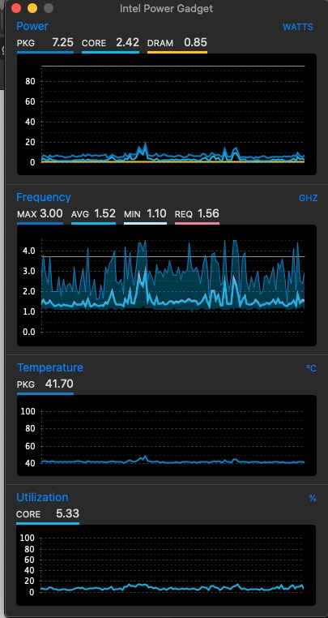

适用系统版本：`10.15`

下载地址：
[直接下载](http://img.oldcai.com/EFIs/z390-i5-9600kf-EFI.zip) (不保证长期可以访问）

[百度网盘](https://pan.baidu.com/s/h12JsNLg4tASF1si-ObSO04w)
提取码: h6vt

已解决问题：
* 能正常关机
* 可睿频、可降频到最低1.1GHz。可能还能更低，未观察到
* 可正常屏幕睡眠
* 可正常休眠

跑分结果：
https://browser.geekbench.com/v5/cpu/653517

CPU 观察工具：[intel Power Gadget](https://software.intel.com/en-us/articles/intel-power-gadget)

CPU Benchmark跑分工具：[Geekbench 5试用版](https://www.geekbench.com/)

